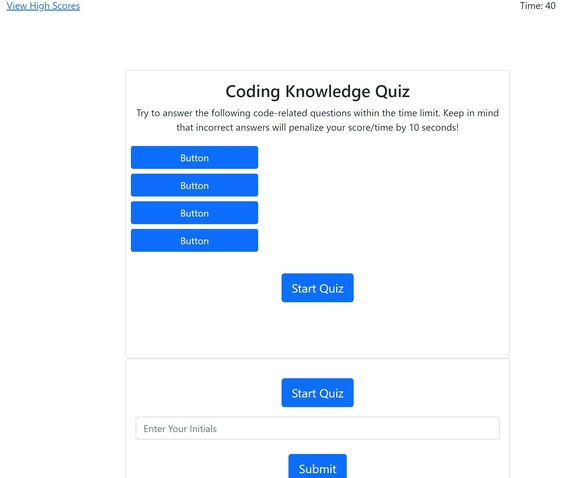
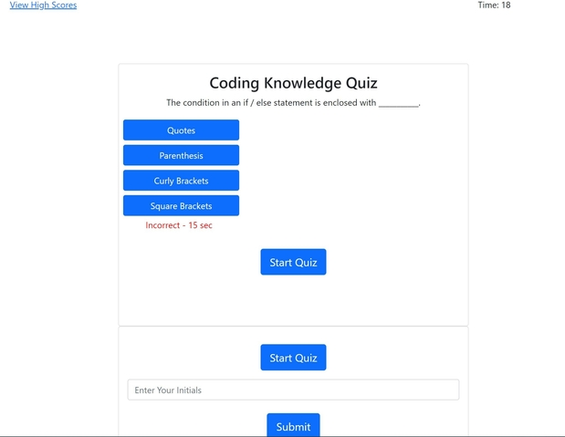
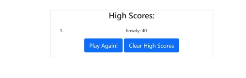

## Descripton
This application is a quiz designed to test JavaScript knowledge of coding students. It functions as a multiple-choice test with a timer that can be affected by correct or incorrect choices. The number left on the timer at the end of the quiz is the student's score, and is saved along all of the other students' scores. The purposes of this is to be able to gauge progress when studying for potential professional coding assessments.

### Issues Resolved
* Start button begins timer
* First question when timer is started
* New question presented after previous answered
* Subtract time when question answered incorrectly
* Game Ends: All questions answered OR timer reaches zero

### Issues Remaining
* Was not able to complete structure of home page in time. 
* Enter ID and buttons appear before needed. 
* Can still take quiz and functions as desired but does not look good as is.

## Screenshots of deployed page

The application will appear as the following once deployed in a traditonal desktop browser:

The application will appear as such during the quiz

The high scores page will appear as the following:

The webpage was not yet optimized for smaller screen sizes

## Usage

The website homepage is intended to be viewed and operated in a traditional desktop browser. While the quiz application functions properly, it has not yet been fully completed for structure.

## Links

Website Homepage:

* [Link to deployed homepage](https://jk1956.github.io/Coding-Progress-Quiz/)

* [Link to github repository](https://github.com/JK1956/Coding-Progress-Quiz)

## References and outside sources
* [Bootstrap 5.0](https://getbootstrap.com/docs/5.0/getting-started/introduction/)
* [JQuery](https://api.jquery.com/)
* [CSS assistance in Bootstrap](https://stackoverflow.com/questions/21415725/bootstrap-css-not-loading)
* [Event propagation in JQuery](https://api.jquery.com/event.stoppropagation/)

## Credits

Project idea and supplementary code provided in modules 3, 4 & 5 of UCF Bootcamp. Code used from Bootstrap and JQuery.

## License

Copyright (c) [year] [fullname]